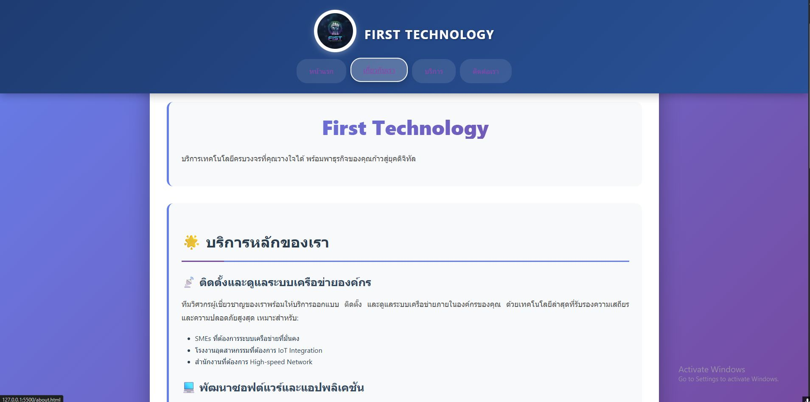
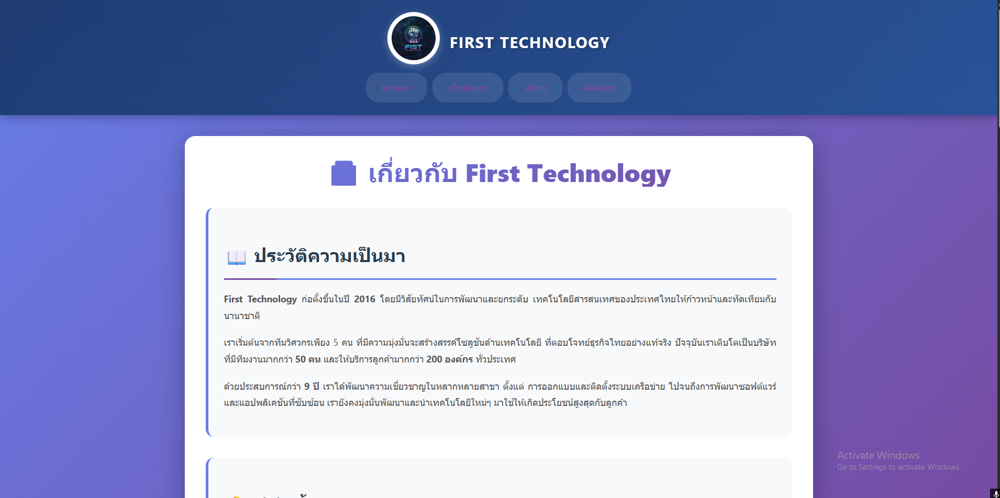
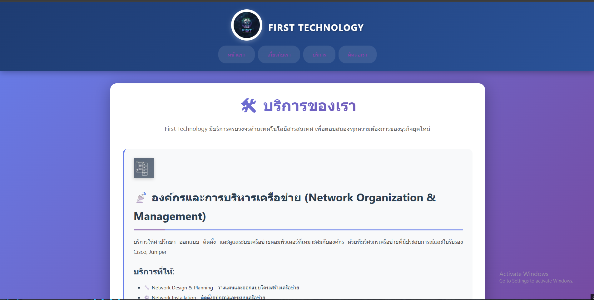
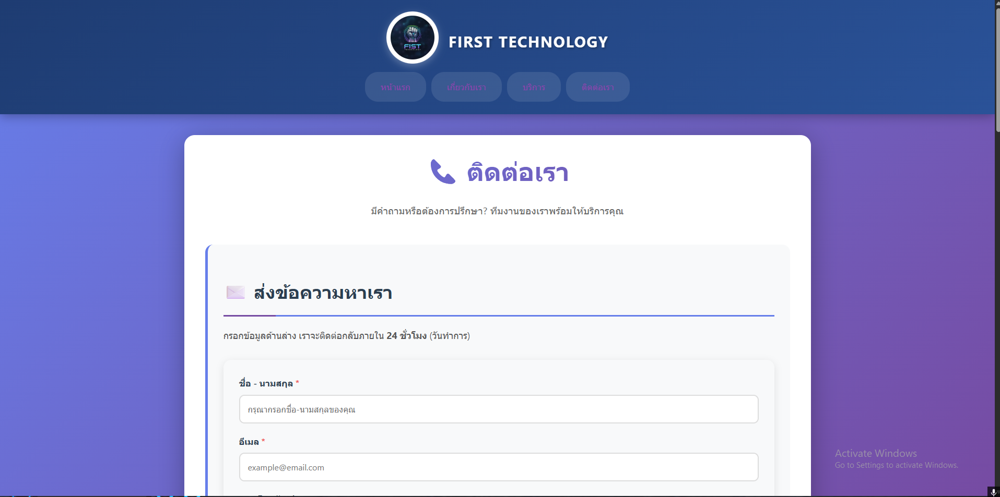

# 🚀 First Technology Website

## 📋 ภาพรวมโปรเจกต์

เว็บไซต์สำหรับบริษัท **First Technology** ที่ให้บริการด้านเทคโนโลยีครบวงจร ออกแบบและพัฒนาด้วย HTML5 และ CSS3 พร้อม Responsive Design ที่รองรับทุกอุปกรณ์

---

## 📁 โครงสร้างไฟล์

```
first-technology-website/
│
├── index.html          # หน้าแรก - แนะนำบริษัทและบริการหลัก
├── about.html          # เกี่ยวกับเรา - ประวัติ พันธกิจ วิสัยทัศน์
├── services.html       # บริการ - รายละเอียดบริการทั้งหมด + ราคา
├── contact.html        # ติดต่อเรา - ฟอร์มติดต่อและข้อมูลสำนักงาน
├── styles.css          # ไฟล์ CSS หลัก - ออกแบบทันสมัย มีสีสันสวยงาม
├── README.md           # เอกสารนี้
│
└── รูปภาพที่ต้องเตรียม/
    ├── Logo.jpg        # โลโก้บริษัท (แนะนำขนาด 100x100 px)
    ├── owner.jpg       # รูปผู้ก่อตั้ง (แนะนำขนาด 400x400 px)
    ├── net.png         # ไอคอนบริการ Network (64x64 px)
    ├── nett.png        # ไอคอนบริการ Software (64x64 px)
    └── nettt.png       # ไอคอนบริการ Web (64x64 px)
```

---

## ✨ คุณสมบัติเด่น

### 🎨 การออกแบบ

- ✅ **Modern Gradient Design** - ใช้ Gradient สีม่วง-น้ำเงินสวยงาม
- ✅ **Responsive Layout** - รองรับ Desktop, Tablet, Mobile
- ✅ **Smooth Animations** - มี Hover Effects และ Transitions
- ✅ **Typography ที่อ่านง่าย** - ใช้ฟอนต์ Segoe UI ที่สวยงาม

### 📱 หน้าต่างๆ

#### 1. **หน้าแรก (index.html)**

- Hero Section พร้อมคำอธิบายบริษัท
- แนะนำบริการหลัก 3 ด้าน
- ข้อดีของการใช้บริการ (Why Choose Us)
- Call-to-Action ชัดเจน

#### 2. **เกี่ยวกับเรา (about.html)**

- ประวัติความเป็นมาของบริษัท (ตั้งแต่ 2016)
- รูปและข้อมูลผู้ก่อตั้ง
- พันธกิจ (Mission) - 4 ข้อ
- วิสัยทัศน์ (Vision) - เป้าหมาย 2030
- ค่านิยมองค์กร (Core Values) - 4 ข้อ

#### 3. **บริการ (services.html)**

- บริการทั้ง 4 ด้าน:
  1. ระบบเครือข่าย (Network)
  2. พัฒนาซอฟต์แวร์ (Software Development)
  3. พัฒนาเว็บไซต์ (Web Development)
  4. IT Support & Maintenance
- ตารางราคาแบบละเอียด (7 แพ็คเกจ)
- Case Studies / ผลงานที่ผ่านมา (3 เคส)

#### 4. **ติดต่อเรา (contact.html)**

- ฟอร์มติดต่อแบบครบถ้วน
- ข้อมูลที่ตั้งสำนักงาน
- ช่องทางติดต่อต่างๆ
- เวลาทำการ
- Social Media Links
- คำถามที่พบบ่อย (FAQ)

---

## 🎨 สีที่ใช้ในเว็บไซต์

| สี              | Hex Code              | ใช้สำหรับ        |
| --------------- | --------------------- | ---------------- |
| Purple Gradient | `#667eea` → `#764ba2` | Background หลัก  |
| Blue Gradient   | `#1e3c72` → `#2a5298` | Header & Footer  |
| Primary Blue    | `#2563eb`             | Headings & Links |
| Success Green   | `#10b981`             | Success Elements |
| Warning Orange  | `#f59e0b`             | Warnings         |
| Danger Red      | `#ef4444`             | Alerts           |
| Text Dark       | `#2c3e50`             | ข้อความหลัก      |
| Text Light      | `#555555`             | ข้อความรอง       |

---








